# Cybersecurity Home Lab - Lab 16: Windows Active Directory Defense

## Overview

This lab serves as the defensive counterpart to Lab 15, which focused on attacking the Active Directory environment through reconnaissance, password spraying, Kerberoasting, credential recovery, SMB enumeration, LDAP enumeration, and BloodHound analysis.

The objective of this lab was to apply defensive controls to the existing `home.lab` Active Directory environment, verify those controls from both the Windows domain controller and attacker perspective, and re-test selected attack techniques.

The lab followed a defensive validation cycle:

**Attack → Evidence → Defensive Control → Re-test → Evidence**

The primary defensive improvements included account lockout enforcement, administrator and service-account hardening, Kerberos encryption hardening, SMB security configuration, LDAP signing, expanded Windows auditing, and validation of delegated administrative permissions.

Several controls were validated directly through controlled activity from the Kali attacker system. Other controls were verified through Windows configuration and event logs.

Network-level SIEM validation with Security Onion was not completed during the final phase because the Security Onion instance was unavailable. Windows-native Security event logging was therefore used for the final detection validation.

---

## Objectives

* Establish a defensive baseline for the Active Directory environment.
* Identify account and authentication weaknesses demonstrated in Lab 15.
* Configure an account lockout policy to reduce password-spraying effectiveness.
* Harden the built-in Administrator account.
* Harden the intentionally vulnerable `lab.service` account.
* Configure explicit AES Kerberos encryption for the service account.
* Rotate the service account password.
* Re-test Kerberoasting after Kerberos hardening.
* Review delegated Active Directory permissions.
* Verify SMB security configuration.
* Verify that SMBv1 remains disabled.
* Require SMB signing and reject unencrypted SMB access.
* Enable LDAP signing.
* Validate that unsigned LDAP authentication is rejected.
* Expand Windows Advanced Audit Policy coverage.
* Validate failed-authentication auditing with Event ID 4625.
* Validate process-creation auditing with Event ID 4688.
* Test account lockout from the attacker perspective.
* Confirm the account lockout from Active Directory.
* Document defensive improvements, limitations, and future enhancements.

---

## Lab Environment

| System      | Role                                     |      IP Address | Operating System    |
| ----------- | ---------------------------------------- | --------------: | ------------------- |
| DC01        | Active Directory Domain Controller / DNS | `192.168.56.10` | Windows Server 2022 |
| KALI-ATTACK | Attacker / validation system             | `192.168.56.40` | Kali Linux          |

### Active Directory

* Domain: `home.lab`
* NetBIOS domain: `HOME`
* Domain Controller: `DC01.home.lab`
* Domain functional level: Windows Server 2016
* Lab network: `192.168.56.0/24`

### Primary Lab Accounts

| Account       | Purpose                                        |
| ------------- | ---------------------------------------------- |
| `lab.user`    | Standard domain user                           |
| `lab.admin`   | Delegated lab administrator                    |
| `lab.service` | Service-account/Kerberos security test account |

The service account was intentionally configured with an SPN during Lab 15 to demonstrate Kerberoasting. Lab 16 hardened this account and re-tested the attack path.

---

## Tools Used

### Windows

* Active Directory PowerShell module
* Active Directory Users and Computers
* `auditpol`
* Windows Event Viewer / Security event log
* SMB Server configuration
* Windows Registry
* PowerShell

### Kali Linux

* NetExec (`nxc`)
* Impacket
* Kerberos client utilities
* OpenLDAP client utilities
* `smbclient`
* `klist`
* `kvno`

---

# Implementation Procedure

## 1. Establish Password Policy Baseline

The existing domain password and lockout policy was captured before making defensive changes.

```powershell
Get-ADDefaultDomainPasswordPolicy |
    Select-Object MinPasswordLength,
                  ComplexityEnabled,
                  PasswordHistoryCount,
                  MaxPasswordAge,
                  MinPasswordAge,
                  LockoutThreshold,
                  LockoutDuration,
                  LockoutObservationWindow
```

### Observed Baseline

* Minimum password length: 7
* Complexity: Enabled
* Password history: 24 passwords
* Maximum password age: 42 days
* Minimum password age: 1 day
* Lockout threshold: **0**
* Lockout duration: 30 minutes
* Lockout observation window: 30 minutes

The most significant weakness for the purposes of Lab 15 was the lockout threshold of `0`, meaning failed authentication attempts would not trigger account lockout.

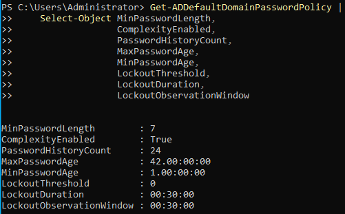

---

## 2. Establish Enabled Account Baseline

Enabled accounts were reviewed for password-related security flags and SPNs.

```powershell
Get-ADUser -Filter 'Enabled -eq $true' -Properties PasswordNeverExpires,PasswordNotRequired,ServicePrincipalName |
    Select-Object Name,
                  SamAccountName,
                  PasswordNeverExpires,
                  PasswordNotRequired,
                  ServicePrincipalName |
    Format-Table -AutoSize
```

### Observed Baseline

The built-in `Administrator` account had `PasswordNeverExpires = True`.

The intentionally vulnerable `lab.service` account had:

* `PasswordNeverExpires = False`
* `PasswordNotRequired = False`
* SPN: `HTTP/labservice.home.lab`

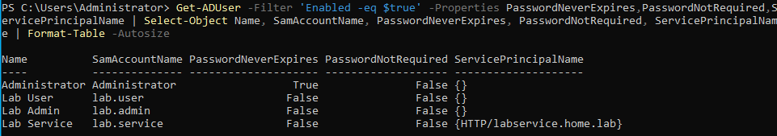

---

## 3. Review Privileged Groups

Membership of the most significant privileged groups was reviewed.

```powershell
Get-ADGroupMember -Identity "Domain Admins" |
    Select-Object Name, SamAccountName, ObjectClass |
    Format-Table -AutoSize

Get-ADGroupMember -Identity "Enterprise Admins" |
    Select-Object Name, SamAccountName, ObjectClass |
    Format-Table -AutoSize

Get-ADGroupMember -Identity "Administrators" |
    Select-Object Name, SamAccountName, ObjectClass |
    Format-Table -AutoSize
```

### Observed Baseline

* `Domain Admins`: Administrator only
* `Enterprise Admins`: Administrator only
* `Administrators`: Domain Admins, Enterprise Admins, Administrator
* `lab.admin` was not a member of these privileged groups.

This confirmed that the delegated lab administrator was not directly placed into the domain's highest-privilege groups.

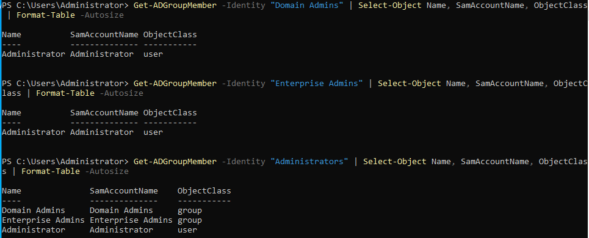

---

## 4. Establish SPN Baseline

Enabled user accounts with SPNs were enumerated.

```powershell
Get-ADUser -Filter 'Enabled -eq $true' -Properties ServicePrincipalName |
    Where-Object { $_.ServicePrincipalName } |
    Select-Object Name, SamAccountName, ServicePrincipalName |
    Format-List
```

Only `lab.service` had an SPN:

```text
HTTP/labservice.home.lab
```

This SPN was intentionally retained for the defensive Kerberoasting comparison.

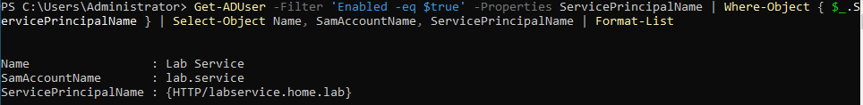

---

## 5. Establish Delegated Password Reset Baseline

The delegated password-reset permission previously created in Lab 14 was reviewed.

```powershell
Get-Acl "AD:\OU=Lab Users,DC=home,DC=lab" |
    Select-Object -ExpandProperty Access |
    Where-Object {
        $_.IdentityReference -like "*Lab-IT-Admins*" -and
        $_.ActiveDirectoryRights -match "ExtendedRight"
    } |
    Select-Object IdentityReference,
                  ActiveDirectoryRights,
                  AccessControlType,
                  ObjectType,
                  InheritanceType
```

The result showed:

* `HOME\Lab-IT-Admins`
* `ExtendedRight`
* `Allow`
* Reset Password extended-right GUID
* Inheritance to descendants

The delegated permission remained intentionally scoped to the `Lab Users` OU.

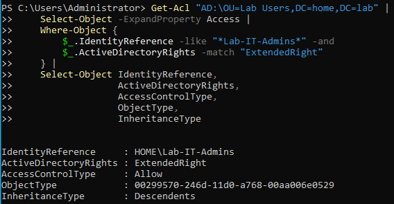

---

## 6. Harden Account Lockout Policy

The domain lockout policy was changed from no lockout to a threshold of five failed attempts.

```powershell
Set-ADDefaultDomainPasswordPolicy `
    -Identity "home.lab" `
    -LockoutThreshold 5 `
    -LockoutDuration (New-TimeSpan -Minutes 15) `
    -LockoutObservationWindow (New-TimeSpan -Minutes 15)
```

The resulting policy was verified.

```powershell
Get-ADDefaultDomainPasswordPolicy |
    Select-Object MinPasswordLength,
                  ComplexityEnabled,
                  PasswordHistoryCount,
                  MaxPasswordAge,
                  MinPasswordAge,
                  LockoutThreshold,
                  LockoutDuration,
                  LockoutObservationWindow
```

### Result

* Lockout threshold: **5**
* Lockout duration: **15 minutes**
* Observation window: **15 minutes**

The other password-policy settings remained unchanged.

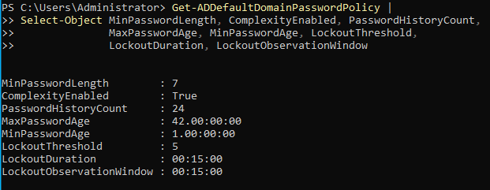

---

## 7. Harden Built-in Administrator Password Expiration

The built-in Administrator account was reviewed.

```powershell
Get-ADUser -Identity "Administrator" -Properties Enabled,
    PasswordNeverExpires,
    PasswordNotRequired,
    PasswordExpired,
    LastLogonDate,
    PasswordLastSet |
    Select-Object Name,
                  SamAccountName,
                  Enabled,
                  PasswordNeverExpires,
                  PasswordNotRequired,
                  PasswordExpired,
                  LastLogonDate,
                  PasswordLastSet
```

The account initially had:

```text
PasswordNeverExpires : True
```

This was changed:

```powershell
Set-ADUser -Identity "Administrator" -PasswordNeverExpires $false
```

The setting was verified afterward.

```powershell
Get-ADUser -Identity "Administrator" -Properties PasswordNeverExpires |
    Select-Object Name, SamAccountName, PasswordNeverExpires
```

### Result

`PasswordNeverExpires` changed from `True` to `False`.

No Administrator password was changed as part of this step.

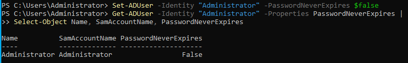

---

## 8. Configure AES Kerberos Encryption for Service Account

The intentionally vulnerable service account was reviewed.

```powershell
Get-ADUser -Identity "lab.service" -Properties `
    ServicePrincipalName,
    msDS-SupportedEncryptionTypes |
    Select-Object SamAccountName,
                  ServicePrincipalName,
                  msDS-SupportedEncryptionTypes
```

The `msDS-SupportedEncryptionTypes` attribute was initially unset.

The service account was explicitly configured for AES128 and AES256 Kerberos encryption:

```powershell
Set-ADUser -Identity "lab.service" `
    -Replace @{"msDS-SupportedEncryptionTypes" = 24}
```

The resulting configuration was verified.

```powershell
Get-ADUser -Identity "lab.service" `
    -Properties ServicePrincipalName, msDS-SupportedEncryptionTypes |
    Select-Object SamAccountName, ServicePrincipalName, msDS-SupportedEncryptionTypes
```

The resulting value was:

```text
msDS-SupportedEncryptionTypes : 24
```

This configuration enables explicit AES128 and AES256 support for the account.

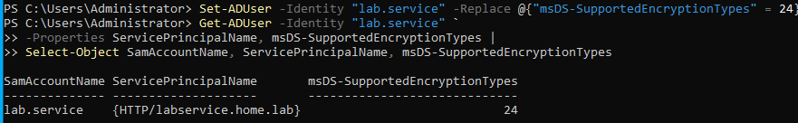

---

## 9. Rotate Service Account Password

The service account's previous Lab 15 password was replaced with a newly generated random password.

The random password was generated using the Windows cryptographic random-number generator:

```powershell
$RNG = [System.Security.Cryptography.RandomNumberGenerator]::Create()
$RNG.GetBytes($RandomBytes)
$ServicePassword = [Convert]::ToBase64String($RandomBytes)
$ServicePassword
```

The generated credential was stored outside the repository and was not included in this documentation.

The password was then reset:

```powershell
Set-ADAccountPassword -Identity "lab.service" -Reset -NewPassword `
(ConvertTo-SecureString $ServicePassword -AsPlainText -Force)
```

The resulting password state was verified:

```powershell
Get-ADUser -Identity "lab.service" -Properties PasswordLastSet, `
PasswordExpired | Select-Object SamAccountName, PasswordLastSet, PasswordExpired
```

The password was successfully changed and was not expired.

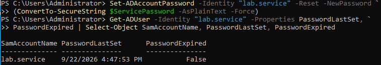

---

## 10. Validate Fresh AES256 Kerberos Service Ticket

From Kali, the existing Kerberos credentials were cleared and a fresh ticket was obtained.

```bash
kdestroy 2>/dev/null
kinit 'lab.user@HOME.LAB'
```

A service ticket for the service account's SPN was requested:

```bash
kvno HTTP/labservice.home.lab
```

The ticket was inspected:

```bash
klist -e
```

### Result

The fresh service ticket used:

```text
aes256-cts-hmac-sha1-96
```

for both the session and ticket encryption type.

This confirmed that the service account's new Kerberos configuration was being used in practice.

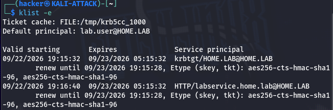

---

## 11. Re-test Kerberoasting After AES Hardening

The Lab 15 Kerberoasting procedure was repeated from Kali using the authenticated `lab.user` account.

```bash
KRB5CCNAME=/tmp/krb5cc_1000 impacket-GetUserSPNs -k -no-pass -dc-ip 192.168.56.10 -request -outputfile ~/lab16-kerberoast.txt home.lab/lab.user
```

The resulting file was inspected without displaying the complete captured credential material:

```bash
head -c 20 ~/lab16-kerberoast.txt
```

The result began with:

```text
$krb5tgs$18$
```

### Comparison With Lab 15

Lab 15 produced an RC4-HMAC Kerberoast material beginning with:

```text
$krb5tgs$23$
```

Lab 16 produced:

```text
$krb5tgs$18$
```

This demonstrates that the service account's Kerberos ticket material changed from RC4-HMAC to AES256.

Kerberoasting was not eliminated entirely because an SPN-backed account can still produce a service ticket. The defensive change altered the encryption type and removed the specific RC4-based attack condition demonstrated in Lab 15.

The full TGS material was intentionally excluded from the repository.

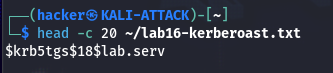

---

## 12. Revalidate Delegated Password Reset Scope

The delegated password-reset permission was reviewed after the other hardening changes.

```powershell
Get-Acl "AD:\OU=Lab Users,DC=home,DC=lab" |
    Select-Object -ExpandProperty Access |
    Where-Object {
        $_.IdentityReference -like "*Lab-IT-Admins*" -and
        $_.ActiveDirectoryRights -match "ExtendedRight"
    } |
    Select-Object IdentityReference,
                  ActiveDirectoryRights,
                  AccessControlType,
                  ObjectType,
                  InheritanceType
```

Group membership was also checked:

```powershell
Get-ADGroupMember -Identity "Lab-IT-Admins" |
Select-Object Name, SamAccountName, ObjectClass |
Format-Table -AutoSize
```

The group contained only:

```text
lab.admin
```

The password-reset permission remained scoped to descendants of the `Lab Users` OU.

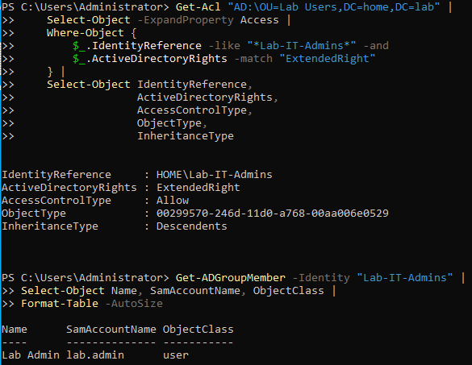

---

## 13. Establish and Validate SMB Security Configuration

The DC01 SMB configuration was reviewed.

```powershell
Get-SmbServerConfiguration |
    Select-Object EnableSMB1Protocol,
                  EnableSMB2Protocol,
                  EnableSecuritySignature,
                  RequireSecuritySignature,
                  RejectUnencryptedAccess
```

### Result

* SMB1: Disabled
* SMB2/3: Enabled
* SMB signing: Enabled
* SMB signing required: Enabled
* Unencrypted access rejected: Enabled

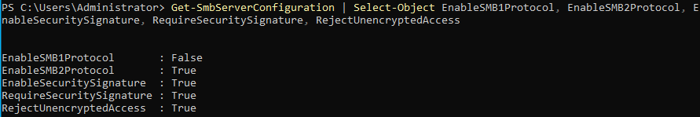

From Kali, SMB security characteristics were checked:

```bash
nxc smb 192.168.56.10
```

The response reported:

```text
signing:True
SMBv1:None
```

This provided attacker-side confirmation that SMB signing was required and SMBv1 was unavailable.

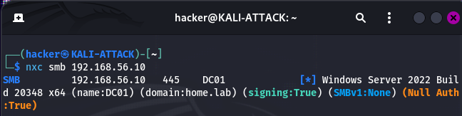

---

## 14. Validate Anonymous SMB Enumeration

Anonymous SMB enumeration was tested:

```bash
smbclient -L //192.168.56.10 -N --option='client min protocol=SMB2'
```

The server accepted the anonymous session, but no shares were enumerated.

The test also reported that SMB1 was disabled.

This result does **not** prove that anonymous authentication is completely disabled. It demonstrates that the tested anonymous SMB session did not expose the available shares through anonymous share enumeration.

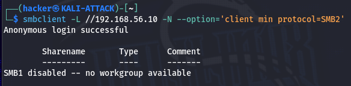

---

## 15. Enable LDAP Signing

The DC01 LDAP signing policy was checked.

```powershell
Get-ItemProperty `
    -Path "HKLM:\SYSTEM\CurrentControlSet\Services\NTDS\Parameters" `
    -Name LDAPServerIntegrity `
    -ErrorAction SilentlyContinue
```

The baseline value was:

```text
LDAPServerIntegrity : 1
```

The value was changed to require signing:

```powershell
Set-ItemProperty `
    -Path "HKLM:\SYSTEM\CurrentControlSet\Services\NTDS\Parameters" `
    -Name LDAPServerIntegrity `
    -Value 2 `
    -Type DWord
```

The new value was verified:

```powershell
Get-ItemProperty `
    -Path "HKLM:\SYSTEM\CurrentControlSet\Services\NTDS\Parameters" `
    -Name LDAPServerIntegrity |
    Select-Object LDAPServerIntegrity
```

The resulting value was:

```text
LDAPServerIntegrity : 2
```

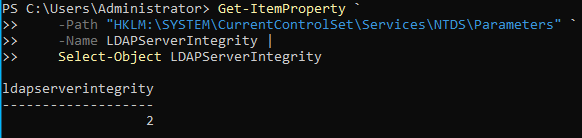

---

## 16. Validate LDAP Signing From Kali

A simple LDAP bind over unencrypted LDAP was attempted from Kali:

```bash
ldapwhoami -x -H ldap://192.168.56.10 -D "lab.service@home.lab" -W
```

The server rejected the bind:

```text
ldap_bind: Strong(er) authentication required (8)
```

The server indicated that integrity protection was required when using non-TLS LDAP.

This directly validates that the DC is no longer accepting the tested unsigned simple LDAP authentication method.

Protected LDAP mechanisms such as Kerberos/GSSAPI were not being disabled by this setting.

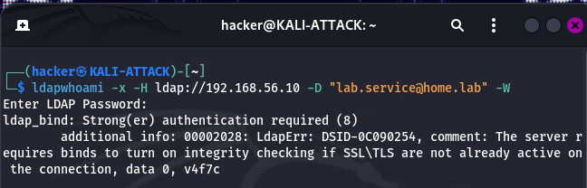

---

## 17. Expand Windows Advanced Audit Policy

The existing audit policy was reviewed with:

```powershell
auditpol /get /category:*
```

Several additional audit subcategories were enabled.

### Process Creation

```powershell
auditpol /set /subcategory:"Process Creation" /success:enable
```

Verified with:

```powershell
auditpol /get /subcategory:"Process Creation"
```

### Directory Service Changes

```powershell
auditpol /set /subcategory:"Directory Service Changes" /success:enable
```

Verified with:

```powershell
auditpol /get /subcategory:"Directory Service Changes"
```

### Group Membership

```powershell
auditpol /set /subcategory:"Security Group Management" /success:enable
auditpol /set /subcategory:"Group Membership" /success:enable
```

Verified with:

```powershell
auditpol /get /subcategory:"Security Group Management","Group Membership"
```

### Detailed File Share

```powershell
auditpol /set /subcategory:"Detailed File Share" /success:enable
```

Verified with:

```powershell
auditpol /get /subcategory:"Detailed File Share"
```

The final audit policy was captured:

```powershell
auditpol /get /category:*
```

The resulting policy included successful auditing for:

* Process Creation
* Directory Service Changes
* Group Membership
* Detailed File Share
* Authentication and account-management events already enabled by the domain

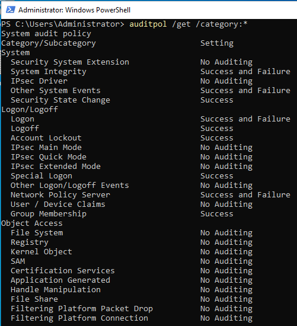

---

## 18. Validate Failed Authentication Detection

A controlled failed SMB authentication was generated from Kali:

```bash
nxc smb 192.168.56.10 -u 'lab.admin' -p 'DefinitelyNotThePassword1!'
```

The attempt returned:

```text
STATUS_LOGON_FAILURE
```

On DC01, the Security log was queried for Event ID 4625:

```powershell
Get-WinEvent -FilterHashtable @{
    LogName = 'Security'
    Id      = 4625
} -MaxEvents 10 |
    Select-Object TimeCreated, Id, ProviderName, Message |
    Format-List
```

The newest event recorded:

* Event ID: `4625`
* Account: `lab.admin`
* Logon Type: `3`
* Source Network Address: `192.168.56.40`
* Authentication Package: `NTLM`
* Failure reason: bad credentials

The Windows event therefore correlated directly with the controlled authentication attempt from Kali.

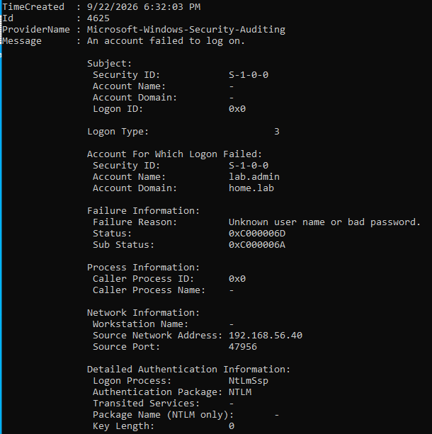

---

## 19. Validate Process Creation Detection

A harmless process was created on DC01:

```powershell
Start-Process notepad.exe
```

The Security log was queried for Event ID 4688:

```powershell
Get-WinEvent -FilterHashtable @{
    LogName = 'Security'
    Id      = 4688
} -MaxEvents 10 |
    Select-Object TimeCreated, Id, Message |
    Format-List
```

The resulting Event ID 4688 recorded:

* Administrator as the creator
* `notepad.exe` as the new process
* PowerShell as the creator process
* Process IDs
* High-integrity mandatory label

This confirmed that Process Creation auditing was functioning.

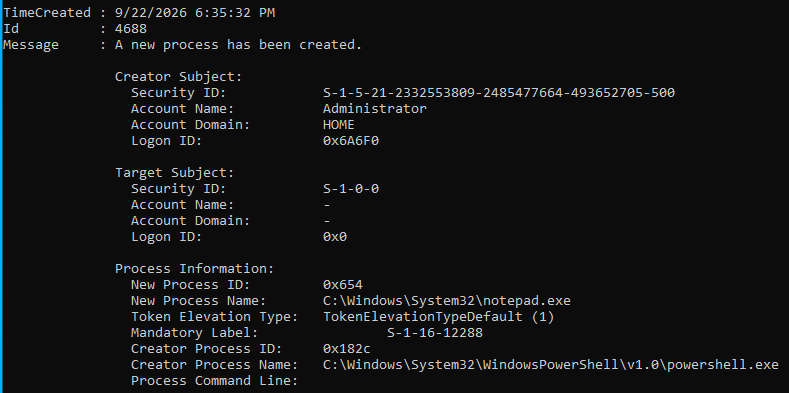

---

## 20. Attempt to Validate Directory Service Changes

A harmless modification was made to `lab.user`:

```powershell
Set-ADUser -Identity "lab.user" -Description "Lab 16 defense validation"
```

The modification was verified:

```powershell
Get-ADUser -Identity "lab.user" -Properties Description |
    Select-Object SamAccountName, Description
```

The change was present.

However, querying Event ID 5136 returned no events:

```powershell
Get-WinEvent -FilterHashtable @{
    LogName = 'Security'
    Id      = 5136
} -MaxEvents 10 |
    Select-Object TimeCreated, Id, Message |
    Format-List
```

The effective audit policy was confirmed:

```powershell
auditpol /get /subcategory:"Directory Service Changes"
```

The result was:

```text
Directory Service Changes    Success
```

The Lab Users OU was then inspected for object-level audit rules. No SACL audit rules were present.

The OU's SDDL also contained no SACL section.

### Result

The global **Directory Service Changes** audit policy is enabled, but Event ID 5136 could not be validated because the relevant Active Directory objects do not currently have the required SACL configuration.

This is documented as a limitation rather than treating the audit policy as successfully validated.

---

## 21. Validate Password-Spray Resistance

The hardened account-lockout policy was tested from Kali using five deliberately incorrect passwords against `lab.admin`.

```bash
nxc smb 192.168.56.10 -u 'lab.admin' -p 'Invalid-Lab16-1!'
nxc smb 192.168.56.10 -u 'lab.admin' -p 'Invalid-Lab16-2!'
nxc smb 192.168.56.10 -u 'lab.admin' -p 'Invalid-Lab16-3!'
nxc smb 192.168.56.10 -u 'lab.admin' -p 'Invalid-Lab16-4!'
nxc smb 192.168.56.10 -u 'lab.admin' -p 'Invalid-Lab16-5!'
```

### Result

The first four attempts returned:

```text
STATUS_LOGON_FAILURE
```

The fifth returned:

```text
STATUS_ACCOUNT_LOCKED_OUT
```

This demonstrated that the configured threshold of five failed attempts was being enforced.

The account state was independently verified on DC01:

```powershell
Get-ADUser -Identity "lab.admin" -Properties LockedOut |
    Select-Object SamAccountName, LockedOut
```

The result was:

```text
SamAccountName    LockedOut
--------------    ---------
lab.admin         True
```

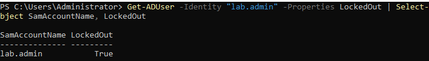

The account was then restored:

```powershell
Unlock-ADAccount -Identity "lab.admin"
```

And verified:

```powershell
Get-ADUser -Identity "lab.admin" -Properties LockedOut |
    Select-Object SamAccountName, LockedOut
```

The final state was:

```text
lab.admin    False
```

---

# Exploitation Results

Lab 16 re-tested selected attack techniques from Lab 15 after defensive controls were applied.

### Password Spraying

**Before:**

The Lab 15 domain lockout threshold was `0`, allowing repeated authentication failures without automatic account lockout.

**After:**

The threshold was changed to `5`.

A controlled five-attempt test produced:

```text
Attempt 1-4: STATUS_LOGON_FAILURE
Attempt 5:   STATUS_ACCOUNT_LOCKED_OUT
```

Active Directory independently confirmed:

```text
LockedOut : True
```

**Conclusion:** The account-lockout control was successfully validated.

---

### Kerberoasting

**Before:**

Lab 15 produced RC4-HMAC Kerberoast material:

```text
$krb5tgs$23$
```

The captured material was successfully recovered offline during Lab 15.

**After:**

`lab.service` was explicitly configured for AES encryption and its password was rotated.

A fresh Kerberos service ticket used:

```text
aes256-cts-hmac-sha1-96
```

The subsequent Kerberoast output began with:

```text
$krb5tgs$18$
```

**Conclusion:** The tested RC4-based Kerberoasting condition was mitigated. Kerberoasting itself was not eliminated because the account still has an SPN and therefore remains capable of receiving a service ticket.

The full TGS material and service-account password were excluded from the repository.

---

### LDAP Authentication

**Before:**

Simple LDAP authentication over plain LDAP was accepted during Lab 15.

**After:**

`LDAPServerIntegrity` was changed from `1` to `2`.

A plain LDAP simple bind returned:

```text
Strong(er) authentication required
```

**Conclusion:** The tested unsigned LDAP authentication path was successfully blocked.

---

### SMB

SMBv1 remained disabled and SMB signing was required.

Kali reported:

```text
signing:True
SMBv1:None
```

Anonymous SMB session establishment was still accepted, but anonymous share enumeration did not expose the server's shares.

**Conclusion:** The tested SMB configuration provides stronger protocol protections, but the presence of an accepted anonymous session means anonymous authentication should not automatically be interpreted as completely disabled.

# Analysis

Lab 16 demonstrated that effective Active Directory defense requires more than changing individual settings. The controls must be verified against the attack techniques they are intended to mitigate.

The account-lockout change provided the clearest example. Lab 15 demonstrated that authentication failures could be generated against multiple accounts while the original lockout threshold was `0`. Lab 16 changed the threshold to five and then reproduced the authentication failure against `lab.admin`. The fifth attempt generated `STATUS_ACCOUNT_LOCKED_OUT`, and Active Directory independently reported the account as locked. This provided both attacker-side and domain-controller evidence.

The Kerberos defense demonstrated a different type of mitigation. The presence of an SPN still allows a service ticket to be requested, so simply enabling AES encryption does not make Kerberoasting impossible. However, the attack material changed from RC4-HMAC (`$23$`) in Lab 15 to AES256 (`$18$`) in Lab 16. Combined with rotation to a newly generated random service-account password, the exact RC4-based credential-recovery path demonstrated in Lab 15 was no longer reproduced.

The LDAP control provided another direct attacker-side validation. Changing `LDAPServerIntegrity` from `1` to `2` caused a simple LDAP bind over unencrypted LDAP to return `Strong(er) authentication required`. This demonstrates the difference between a configuration value and a control that has actually been observed enforcing a security requirement.

SMB hardening also showed why individual observations must be interpreted carefully. SMBv1 was unavailable and signing was required. Anonymous SMB session establishment, however, was still accepted. Because anonymous share enumeration did not expose any shares, the evidence does not justify describing the server as having unrestricted anonymous SMB access.

The audit-policy work demonstrated an important distinction between **global audit policy** and **object-level auditing**. Process Creation auditing successfully produced Event ID 4688, and failed authentication generated Event ID 4625. Directory Service Changes was enabled globally, but a test modification did not produce Event ID 5136 because the relevant directory objects lacked the required SACL configuration. This limitation was preserved rather than treating the policy configuration alone as proof of successful directory-change detection.

The overall result is a more defensible Active Directory environment than the baseline established during Lab 15, while still leaving identifiable areas for additional hardening and monitoring.

---

# Findings

## Finding 1 — Account Lockout Was Previously Disabled

**Severity:** High

**Evidence:**

The original domain policy had:

```text
LockoutThreshold : 0
```

The policy was changed to five attempts.

A controlled test subsequently caused `lab.admin` to become locked after the fifth failed authentication attempt.

**Impact:**

A threshold of zero permits unlimited authentication failures from the perspective of the domain lockout mechanism. This increases exposure to password-spraying and repeated credential-guessing attempts.

**Remediation:**

A lockout threshold of five attempts was configured with a 15-minute lockout duration and observation window.

**Validation:**

Confirmed through both Kali and Active Directory.

---

## Finding 2 — Service Account Used a Weak Kerberos Encryption Condition

**Severity:** High

**Evidence:**

Lab 15 produced RC4-HMAC Kerberoast material:

```text
$krb5tgs$23$
```

Lab 16 configured explicit AES support and subsequently produced:

```text
$krb5tgs$18$
```

A fresh service ticket was also confirmed as AES256.

**Impact:**

RC4-HMAC service tickets enabled the credential-recovery demonstration performed in Lab 15.

**Remediation:**

* Explicit AES128/AES256 configuration
* Service-account password rotation
* Randomly generated replacement credential

**Validation:**

Confirmed through fresh Kerberos ticket inspection and attacker-side Kerberoast re-test.

---

## Finding 3 — Built-in Administrator Password Never Expired

**Severity:** Medium

**Evidence:**

The Administrator account initially had:

```text
PasswordNeverExpires : True
```

The setting was changed to:

```text
PasswordNeverExpires : False
```

**Impact:**

A non-expiring privileged credential increases the potential lifetime of a compromised password.

**Remediation:**

Password expiration was enabled for the built-in Administrator account.

---

## Finding 4 — Unsigned LDAP Authentication Was Previously Permitted

**Severity:** High

**Evidence:**

The original `LDAPServerIntegrity` value was `1`.

After changing it to `2`, a plain LDAP simple bind from Kali returned:

```text
Strong(er) authentication required
```

**Impact:**

Unsigned LDAP authentication can expose authentication traffic to tampering or relay-related attack scenarios.

**Remediation:**

LDAP signing was configured as required.

**Validation:**

Confirmed from the Kali attacker system.

---

## Finding 5 — Directory Service Changes Require Object-Level SACL Configuration

**Severity:** Medium

**Evidence:**

The global audit policy reported:

```text
Directory Service Changes    Success
```

An actual AD object modification succeeded, but Event ID 5136 was not generated.

Inspection of the `Lab Users` OU showed no SACL audit entries.

**Impact:**

Enabling the global audit subcategory alone does not provide complete object-change telemetry when the required object-level audit rules are absent.

**Remediation:**

Configure an appropriate SACL for the relevant AD objects and validate Event ID 5136 generation.

**Status:**

Not fully validated in this lab.

---

# Security Observations

1. **Configuration should be tested from the attacker's perspective whenever possible.**
   SMB, LDAP, Kerberos, and account lockout controls were validated through actual network activity from Kali.

2. **Audit policy and audit coverage are separate concepts.**
   A global audit setting may be enabled without producing useful object-level events unless the appropriate SACL exists.

3. **Kerberoasting is not eliminated solely by changing encryption types.**
   SPN-backed accounts can still receive service tickets. The objective was to eliminate the RC4 condition demonstrated in Lab 15 and strengthen the service account's credential.

4. **Anonymous authentication requires careful interpretation.**
   The SMB server accepted an anonymous session, but the tested anonymous enumeration did not expose shares. The evidence does not establish unrestricted anonymous access.

5. **Windows-native telemetry can provide useful detection evidence even without a SIEM.**
   Events 4625 and 4688 were directly correlated with controlled activity.

6. **Evidence must distinguish configuration from validation.**
   Directory Service Changes is documented as configured but not fully validated because the necessary SACL was absent.

---

# Troubleshooting

## Kerberos Random Password Generation

The initial attempts to generate a random service-account password used APIs unavailable in the installed PowerShell environment.

The working implementation used:

```powershell
$RNG = [System.Security.Cryptography.RandomNumberGenerator]::Create()
$RNG.GetBytes($RandomBytes)
$ServicePassword = [Convert]::ToBase64String($RandomBytes)
```

This successfully generated the replacement credential.

---

## Kali Host-Only Network Connectivity

Kali temporarily reported the DC01 address as an incomplete/failed ARP entry even though both systems were configured on the same VirtualBox Host-Only network.

The network returned to normal after rebooting Kali without configuration changes.

The issue was therefore treated as a transient networking condition rather than a permanent configuration problem.

---

## Directory Service Changes Event 5136 Not Generated

The `Directory Service Changes` audit subcategory was confirmed as enabled.

The AD modification itself was also confirmed.

However, no Event ID 5136 was generated because the relevant OU lacked SACL audit entries.

This was documented as an incomplete validation rather than repeatedly modifying the environment without a clear requirement.

---

## Security Onion Unavailable

Security Onion was originally planned for the final detection-validation phase.

The Security Onion VM became inaccessible because the VM login credentials could not be restored successfully after password recovery attempts.

Network-level SIEM validation was therefore deferred.

Windows-native Security event logging was used instead for the final validation phase.

---

# Lessons Learned

* Account lockout settings can directly change the effectiveness of password spraying.
* Privileged accounts should not use non-expiring passwords without a specific operational requirement.
* Service accounts with SPNs require particular attention because their tickets can be requested by authenticated domain users.
* Kerberos encryption configuration should be validated by examining actual ticket encryption types.
* Password rotation is an important companion control when hardening a service account.
* LDAP signing can be tested directly from an attacker system by attempting an unsigned bind.
* SMB signing and SMBv1 status can be independently observed from the network.
* Windows audit policy is only part of the detection configuration; object-level SACLs may also be required.
* Event IDs should be correlated with the activity that generated them instead of being treated as proof of compromise by themselves.
* Defensive testing should preserve evidence of both successful controls and incomplete validation.

---

# Future Improvements

* Configure appropriate AD SACLs for critical OUs and validate Event ID 5136.
* Expand auditing for sensitive Active Directory object modifications.
* Develop centralized detection rules for Events 4625, 4688, 5136, 4740, 4768, and 4769.
* Restore Security Onion or another SIEM and repeat the network-level detection phase.
* Add Windows Event Forwarding or another centralized log-collection mechanism.
* Implement stronger service-account management practices such as group Managed Service Accounts where appropriate.
* Review all domain accounts for unnecessary SPNs.
* Review privileged group membership periodically.
* Add automated PowerShell checks for insecure account settings.
* Expand the lab to include Active Directory attack-path detection and response automation.

---

# MITRE ATT&CK Mapping

| Technique                                      | Technique ID                    | Lab Relevance                                                                                |
| ---------------------------------------------- | ------------------------------- | -------------------------------------------------------------------------------------------- |
| Password Policy Discovery                      | T1201                           | Password and lockout policy was enumerated during the defensive baseline                     |
| Valid Accounts                                 | T1078                           | Recovered/known credentials were used during controlled validation                           |
| Brute Force: Password Spraying                 | T1110.003                       | Lab 15 demonstrated password spraying; Lab 16 validated account-lockout defenses             |
| Steal or Forge Kerberos Tickets: Kerberoasting | T1558.003                       | Lab 15 demonstrated Kerberoasting; Lab 16 changed service-ticket encryption                  |
| Network Service Scanning                       | T1046                           | SMB/LDAP service exposure was validated during defensive testing                             |
| Remote Services: SMB/Windows Admin Shares      | T1021.002                       | SMB security configuration was validated from Kali                                           |
| Process Discovery / Execution Telemetry        | T1057 / T1204-related telemetry | Process creation auditing was validated through Event 4688                                   |
| Account Access Removal                         | T1531                           | Account lockout was demonstrated as a defensive response to repeated authentication failures |

The mappings describe the techniques exercised or observed during the lab. They do not imply that every mapped technique resulted in successful compromise.

---

# Cybersecurity Lab Roadmap

| Lab    | Topic                       | Status       |
| ------ | --------------------------- | ------------ |
| 1      | Build Cybersecurity Lab     | Complete     |
| 2      | Network Discovery with Nmap | Complete     |
| 3      | Wireshark Traffic Analysis  | Complete     |
| 4      | Vulnerability Scanning      | Complete     |
| 5      | Metasploit Framework        | Complete     |
| 6      | Password Attacks            | Complete     |
| 7      | Web Application Security    | Complete     |
| 8      | Windows Logging             | Complete     |
| 9      | Wazuh SIEM                  | Complete     |
| 10     | Security Onion              | Complete     |
| 11     | MITRE ATT&CK Mapping        | Complete     |
| 12     | Detection Engineering       | Complete     |
| 13     | Incident Response           | Complete     |
| 14     | Active Directory            | Complete     |
| 15     | Active Directory Attacks    | Complete     |
| 16     | Active Directory Defense    | Complete     |
| 17     | Azure Fundamentals          | Planned      |
| 18     | Microsoft Sentinel          | Planned      |
